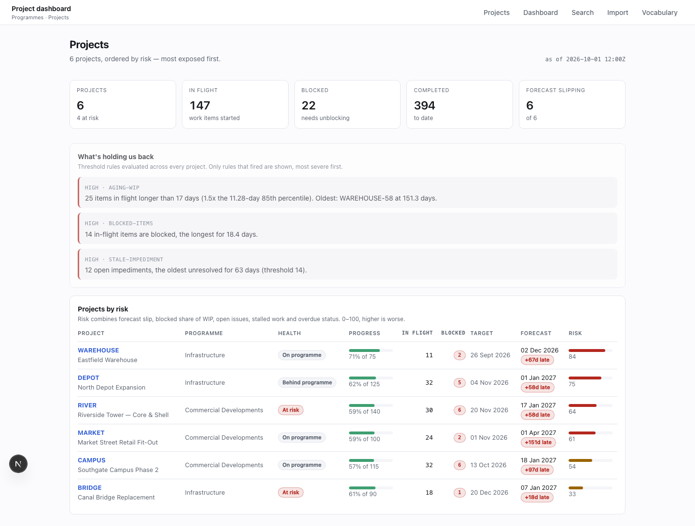
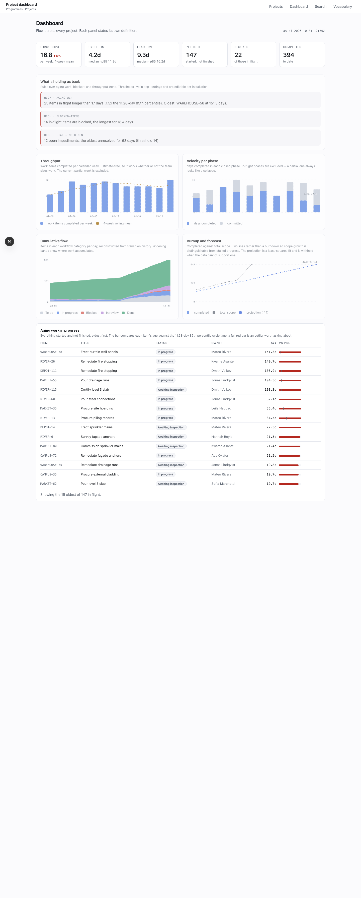
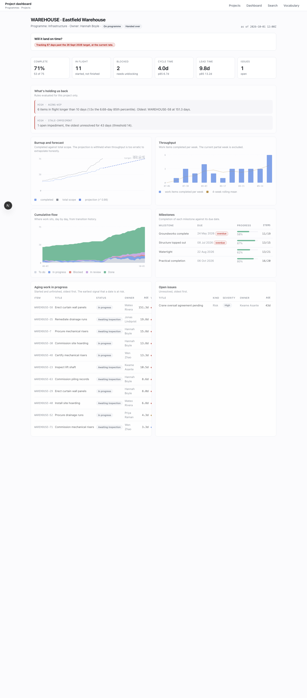

# Project manager dashboard

A project management dashboard you clone, point at your own work, and let an
agent reshape for your industry.

It is built around one claim: **nothing in it is specific to software.** The
same codebase serves a construction PM, an interior designer and an engineering
team, because the vocabulary lives in the database as editable rows rather than
in the code as fixed types. The screenshots below are the construction preset —
"Phase", "Work item", "Awaiting inspection" — and no component was changed to
produce them.



## Three views

**Projects** — every project on one screen, sorted by risk rather than
alphabetically. A portfolio view that has to be scanned has failed at its job;
the top row should be the one you would have raised in the meeting anyway.

**Dashboard** — the charts, with each panel stating its own definition. A
number a viewer cannot interrogate gets mistrusted, and "velocity" means four
different things across four teams.



**A single project** — opens with a sentence answering "will this land on
time", then the evidence behind it.



## Start it

```bash
./scripts/dev.sh
```

One command: starts your container runtime (Colima, Docker Desktop, OrbStack or
Podman — whichever you have), waits for Postgres, applies migrations, seeds demo
data if the database is empty, and serves the app on
[localhost:3000](http://localhost:3000).

First time on a new machine, run `./scripts/preflight.sh` first. It inventories
what you need, offers to install anything missing, and generates a `.env` with
fresh secrets.

```bash
./scripts/dev.sh --preset construction   # or software, interior-design, generic
./scripts/db-reset.sh --volume           # start the database over
npm run test:visual                      # screenshots
```

## Make it yours

Pick the closest preset and edit from there. A preset is one JSON file in
[`packages/db/presets/`](packages/db/presets/) holding your nouns and your
starting vocabulary — no migration, no code change:

```bash
cp packages/db/presets/generic.json packages/db/presets/legal.json
# edit it
npm run db:preset -- legal
```

Once applied, every term is yours to rename, reorder, add to or archive.

### Why the vocabulary is data, not code

Postgres can add a value to an enum but can never remove one. An app that
promises "delete the categories you do not want" cannot be built on them — so
item types, statuses, severities and health labels are rows in
`taxonomy_terms`, and only things with behaviour attached stay as enums.

The bridge is one column. Each of your workflow statuses points at a fixed
`status_category` (`todo`, `in_progress`, `blocked`, `in_review`, `done`,
`cancelled`). Create "Awaiting inspection", point it at `in_review`, and every
flow chart keeps working without knowing the word exists.

[`docs/TAXONOMIES.md`](docs/TAXONOMIES.md) has the detail.

## What it measures

Every definition is stated in code, repeated in
[`docs/METRICS.md`](docs/METRICS.md), and asserted by a test against a fixed
fixture — so changing a definition breaks a test instead of quietly redrawing a
chart.

- **Throughput** — items completed per week. Estimate-free, so it works for
  teams and trades that never size work.
- **Velocity** — per closed cycle. Partial cycles are excluded; an in-flight
  one always looks like a collapse.
- **Cycle and lead time** — median and 85th percentile, never a mean. The
  distribution is long-tailed, and the mean overstates the typical case while
  understating the tail.
- **Cumulative flow** — reconstructed from transition history, which is the
  only way to answer "how long did this sit in review".
- **Aging WIP** — the most actionable table here. It tells you which item to go
  ask about, earlier than any trend line, because work stops moving long before
  a chart bends.
- **Burnup and forecast** — a least-squares projection that **refuses** when
  there is too little history, when throughput is flat, or when the fit is too
  poor to extrapolate honestly. A confident line through three points gets
  screenshotted into a status deck and then defended.
- **Triggers** — "what's holding us back", as fired rules with the number that
  fired them, not a list of warnings.

No flamegraph. It answers a profiler's question, not a project manager's.

## How it is put together

```
apps/web          Next.js — the three views and the BFF
packages/db       Drizzle schema, metric queries, presets, deterministic seed
apps/ingestion    Python CSV ingestion (in progress)
scripts           preflight, dev, db-reset, screenshots
```

Charts are hand-written inline SVG. No charting library: a library that
animates on mount or derives tick counts from measured width renders
differently on every run, which makes visual regression impossible. These are
byte-identical across runs, cost no hydration on a read-only page, and print.

## Working on it

```bash
npm run lint && npm run typecheck && npm test   # what pre-commit runs, ~5s
npm run hooks:install                           # enable the git hooks
```

Everything slow — Postgres, the browser, the screenshots — runs in CI, where it
can take the time it needs. [`docs/TESTING.md`](docs/TESTING.md) explains the
split, and why the fixture's clock is pinned.

### When something breaks

Every response carries an `x-correlation-id` header, and every log line in
every tier carries the same field. One id reconstructs the whole operation —
the page render, each query it ran, and any import it triggered:

```bash
jq -s 'map(select(.correlation_id=="a1b2c3")) | sort_by(.ts)' logs/*.log
```

Secrets are redacted at the serialiser rather than at each call site, because
per-call-site redaction works right up until somebody forgets.

- [`AGENTS.md`](AGENTS.md) — the single source of truth for agents
- [`docs/TRIAGE.md`](docs/TRIAGE.md) — symptom-to-cause table, integrity queries, useful one-liners
- [`docs/TESTING.md`](docs/TESTING.md) — the suites and the pinned clock
- [`docs/API.md`](docs/API.md) — the HTTP API, with Swagger UI at `/api/docs`
- [`docs/INGESTION.md`](docs/INGESTION.md) — CSV import and the connector contract
- [Issues and milestones](https://github.com/smantzou93/project-manager-dashboard-generic/issues)

## A note on secrets

This repository is public. `.env` is generated locally, gitignored, and never
committed; only `.env.example` with placeholders is in the tree. Connector
credentials are referenced by environment variable _name_ and resolved at run
time, because the database gets backed up and this repo can be read by anyone.
The pre-commit hook refuses a commit that stages `.env` or a literal secret.
